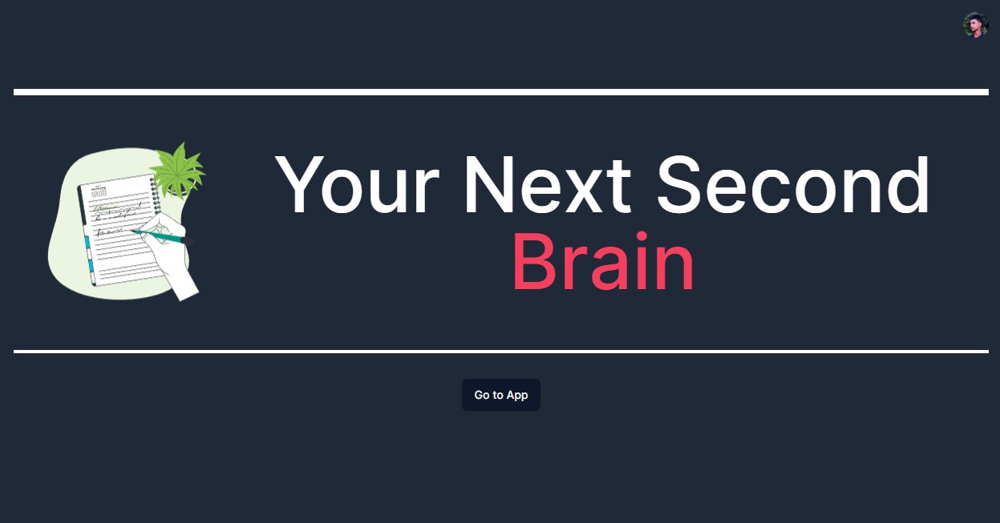

This project was done by following the [Medium article](https://levelup.gitconnected.com/full-stack-next-js-notion-clone-clerk-prisma-planetscale-tiptap-shadcn-ui-5cae5ad7bfc7).

<!-- screenshot image-->


This is a [Next.js](https://nextjs.org/) project bootstrapped with [`create-next-app`](https://github.com/vercel/next.js/tree/canary/packages/create-next-app).

## Getting Started

First, run the development server:

```bash
npm run dev
# or
yarn dev
# or
pnpm dev
```


Make sure you add env variables :)
